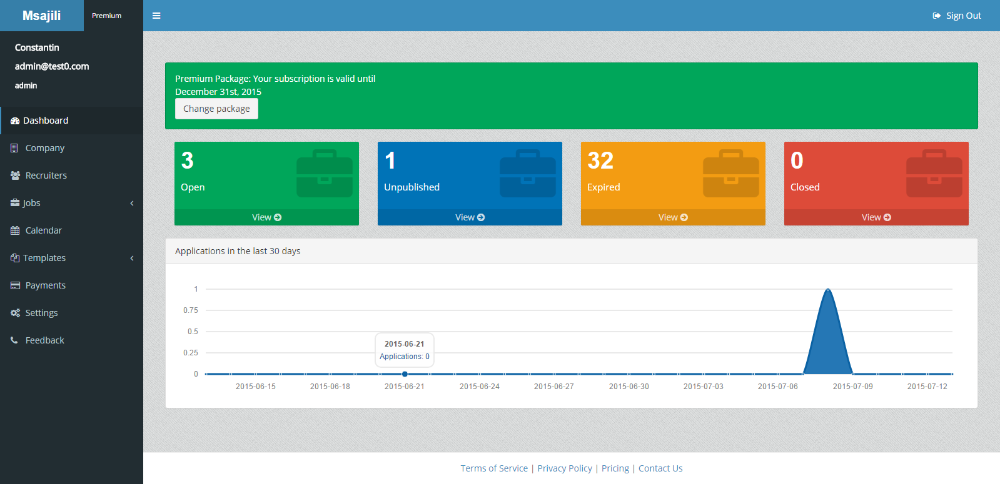
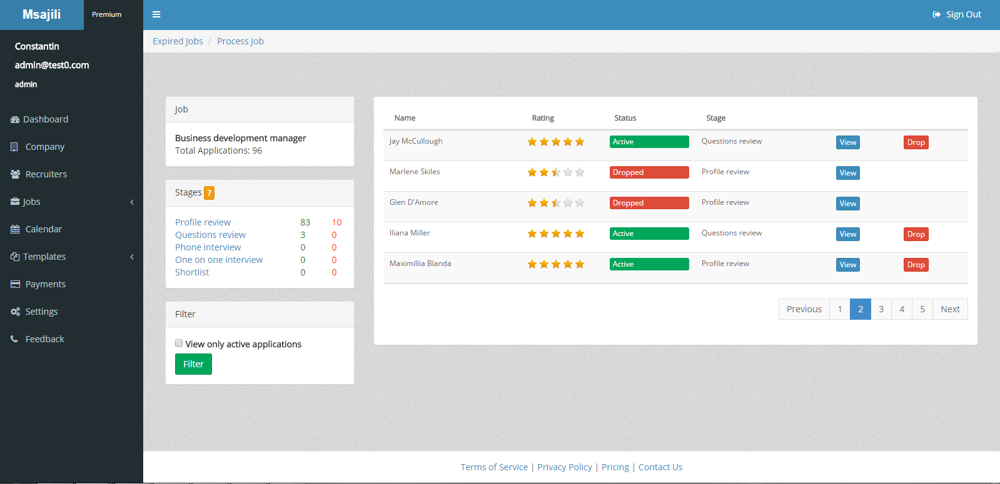
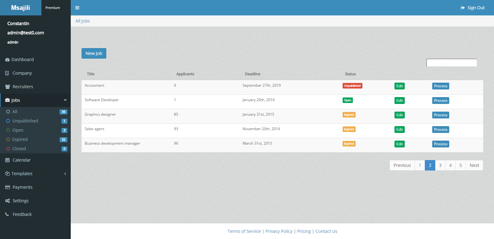
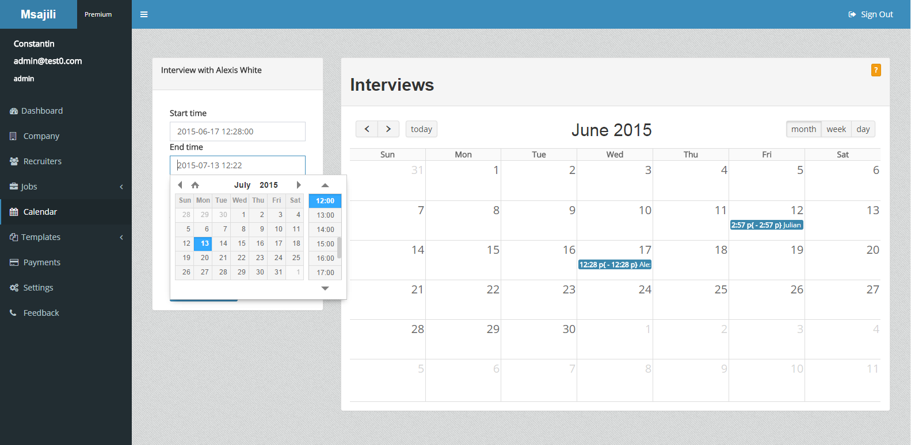

# Msajili
Allows the ease in shortlisting, scheduling interviews, providing feedback and tracking hiring progress.

Rails 4.1.6
Ruby 2.0.0

# Screens

# Ruby Version
- 2.0.0

# Requirements

- RVM

We will use RVM for our rubies. To install rvm stable with ruby just run the following command

\curl -sSL https://get.rvm.io | bash -s stable --ruby

Once its finished open a new terminal and type '/bin/bash --login' then 'rvm list' This will list
the installed ruby which is the latest version.
Our app uses ruby version 2.0.0 so proceed on to install it using

rvm install 2.0.0

Next lets set ruby 2.0.0 as our current and default version

rvm use 2.0.0 --default

- QT

Some of our gems will need libqt to build. Just type the following:

sudo apt-get install libqt4-dev libqtwebkit-dev

- NodeJs

The app needs a javascript runtime so we will use nodejs

sudo apt-get install nodejs

- Mail Catcher gem

We use this gem for email on the dev environment. We dont put it on the gemfile because it may clash with the current gems

rvm default@mailcatcher --create do gem install mailcatcher
rvm wrapper default@mailcatcher --no-prefix mailcatcher catchmail
rvm default@mailcatcher do gem install i18n -v 0.6.11
rvm default@mailcatcher do gem uninstall i18n -Ix --version '>0.6.11'

mailcatcher
Go to http://localhost:1080/

#run in development mode

rvmsudo foreman start --env=development.env

#installation

Make sure you are at the root of the project and run the following command

bundle install

Open database.yml file and set the password to the one you used for your postgres user

Create the database and seed it

rake db:create
rake db:rebuild

To insert several rows of dummy data(..Ok alot!) just run the following task. Warning, this command recreates the database
so it should NEVER be run on a production environment.

rake db:populate

The above rake task will take about 10-15 minutes to complete?

Since the production environment uses foreman and upstart we will use the same for our development
environment to maintain uniformity and also detect problems before pushing to production.

Check out the section on upstart below.

#rvm foreman and upstart setup

Create an rvm alias

    rvm alias create msajili ruby-2.0.0-p576@msajili
    rvm use msajili

add this at the beginning of your .env file's PATH variable  "/usr/local/rvm/wrappers/msajili"

Where:

    /usr/local/rvm - is echo $rvm_path
    wrappers - is static always the same
    msajili - is the alias name

export upstart configuration

    rvmsudo foreman export upstart --app=msajili --user=ubuntu /etc/init --env=production.env
